# Formal Verification for Verilog Hardware Design

A comprehensive guide for hardware designers familiar with Verilog who want to start using formal verification.

## Table of Contents
- [Introduction](#introduction)
- [What is Formal Verification?](#what-is-formal-verification)
- [Formal Verification vs. Simulation](#formal-verification-vs-simulation)
- [Key Concepts](#key-concepts)
- [Setting Up Your Environment](#setting-up-your-environment)
- [Writing Formal Properties](#writing-formal-properties)
- [Configuring SymbiYosys (.sby files)](#configuring-symbiyosys-sby-files)
- [Running Formal Verification](#running-formal-verification)
- [Analyzing Results](#analyzing-results)
- [Practical Example Walkthrough](#practical-example-walkthrough)
- [Best Practices](#best-practices)
- [Common Pitfalls](#common-pitfalls)

---

## Introduction

If you've been designing hardware with Verilog, you're probably familiar with traditional simulation-based testing: you write testbenches, apply stimulus, and check outputs. While simulation is powerful, it only verifies the specific scenarios you test. **Formal verification** takes a different approach—it mathematically proves that your design behaves correctly for **all possible inputs** and states.

This guide will teach you how to add formal verification to your Verilog workflow using SymbiYosys (sby), an open-source formal verification tool.

---

## What is Formal Verification?

Formal verification uses mathematical methods to prove (or disprove) that your hardware design meets its specification. Instead of running specific test cases, formal tools explore the entire state space of your design.

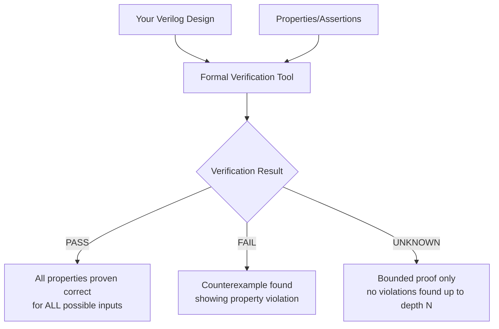

### Key Benefits

- **Exhaustive Coverage**: Checks all possible input combinations and state sequences
- **Bug Finding**: Discovers corner cases that manual test cases might miss
- **Mathematical Proof**: Provides certainty rather than confidence
- **Documentation**: Properties serve as executable specifications

---

## Formal Verification vs. Simulation

| Aspect | Simulation | Formal Verification |
|--------|-----------|-------------------|
| **Coverage** | Only tests specific scenarios you write | Explores all possible behaviors |
| **Runtime** | Fast for individual tests | Can be slow for complex designs |
| **Proof** | Shows design works for tested cases | Mathematically proves correctness |
| **Debugging** | You control the stimulus | Tool generates counterexamples |
| **Best For** | Large designs, functional testing | Critical logic, corner cases |
| **Limitations** | May miss corner cases | State space explosion for large designs |

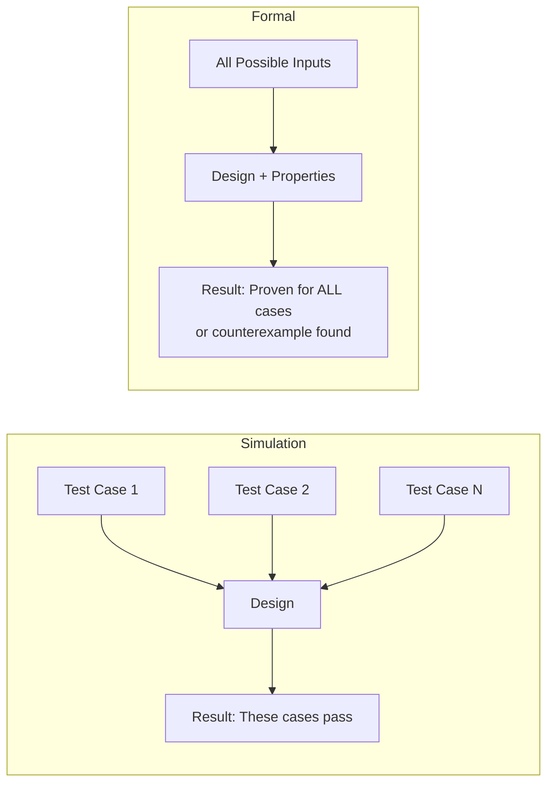

**When to Use Both**: The most effective verification strategy combines simulation for functional verification of large systems and formal verification for proving critical properties of smaller modules.

---

## Key Concepts

### 1. Assertions

**Assertions** are statements that must always be true. They check that your design behaves correctly.

```verilog
// Example: After reset, output must be zero
if ($past(rst_n) == 0) begin
    assert(output_signal == 0);
end
```

### 2. Assumptions

**Assumptions** constrain the inputs to your design, telling the formal tool what input conditions are valid.

```verilog
// Example: Assume reset is initially asserted
initial assume(rst_n == 0);
```

### 3. Cover Properties

**Cover** statements ask the tool to find an input sequence that makes a condition true. They're useful for checking reachability and validating your assumptions.

```verilog
// Example: Can the design reach a state where output is all 1's?
cover(output_signal == 7'b1111111);
```

### 4. Bounded Model Checking (BMC)

BMC verifies properties up to a certain number of clock cycles (depth). It can find bugs but cannot prove correctness for all time.

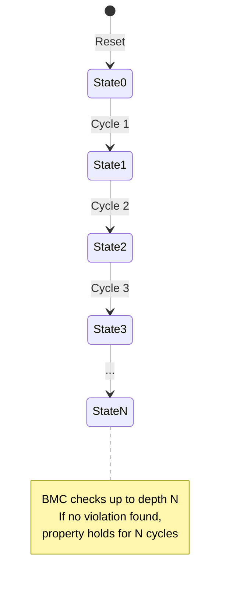

**Result**: `PASS` means no violations found within the bounded depth (but doesn't prove correctness for all time).

### 5. Temporal Logic

Temporal operators let you reason about sequences of events over time:

- `$past(signal)`: Value of signal in the previous clock cycle
- `$past(signal, N)`: Value of signal N clock cycles ago
- `$stable(signal)`: Signal hasn't changed since last cycle
- `$rose(signal)`: Signal was 0, now it's 1
- `$fell(signal)`: Signal was 1, now it's 0

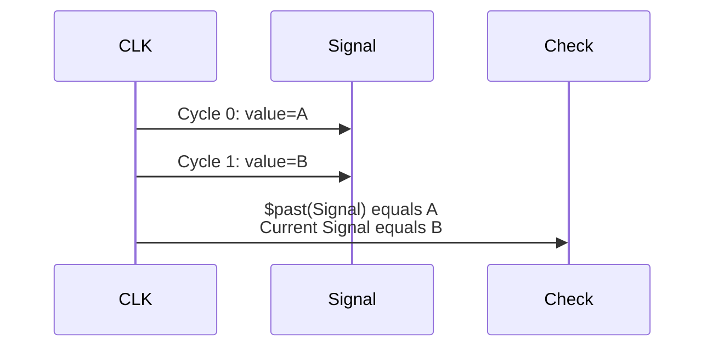

---

## Setting Up Your Environment

### Prerequisites

This project uses **SymbiYosys (sby)**, which is included in the IIC-OSIC-TOOLS Docker container.

### Verifying Installation

```bash
# Check if sby is available
sby --version

# Check if yosys is available (sby uses yosys internally)
yosys --version
```

### Tool Chain

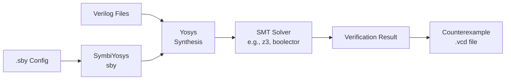

---

## Writing Formal Properties

### Basic Structure

Formal properties are embedded in your Verilog testbench using SystemVerilog assertions:

```verilog
`ifdef FORMAL
    // Formal verification code here
    reg f_past_valid = 0;
    
    always @(posedge clk) begin
        f_past_valid <= 1;
        
        if (f_past_valid) begin
            // Assertions and covers here
        end
    end
`endif
```

### Why `f_past_valid`?

The `f_past_valid` register ensures that `$past()` functions have valid data. In the first clock cycle, there's no "past," so we skip checks until the second cycle.

### Example 1: Reset Behavior

```verilog
// Property: After reset, all outputs must be zero
if ($past(rst_n) == 0) begin
    assert(output_pins == 7'b0);
end
```

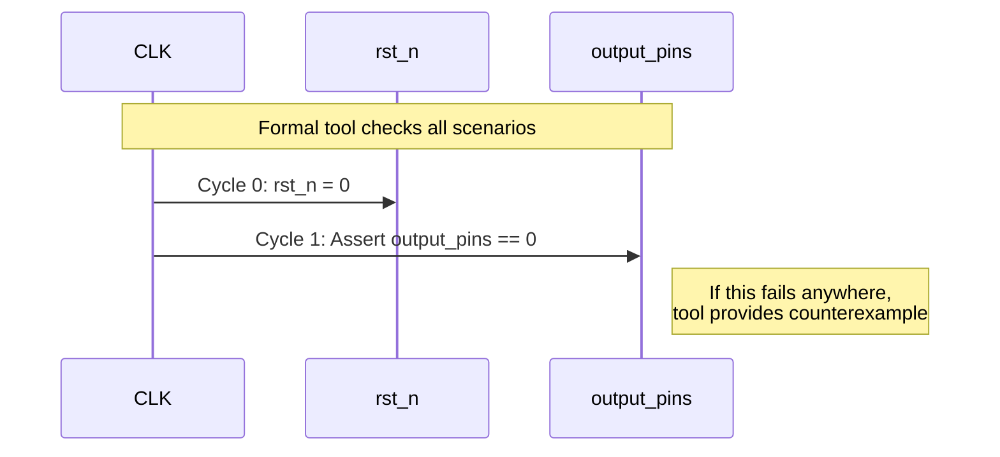

### Example 2: Conditional Logic

```verilog
// Property: When invert_polarity is set, output should be inverted input
if ($past(invert_polarity)) begin
    assert(output_value == ~$past(input_value));
end else begin
    assert(output_value == $past(input_value));
end
```

### Example 3: Cover Properties

```verilog
// Cover: Can we reach a state where output is non-zero with invert enabled?
cover($past(invert_polarity) && output_value != 7'b0);
```

### Practical Testbench Template

```verilog
`default_nettype none
`timescale 1ns/1ps

module my_design_tb;
    // Declare testbench signals
    reg clk;
    reg rst_n;
    reg [7:0] input_data;
    wire [7:0] output_data;
    
    // Instantiate design under test
    my_design uut (
        .clk(clk),
        .rst_n(rst_n),
        .input_data(input_data),
        .output_data(output_data)
    );
    
`ifdef FORMAL
    reg f_past_valid = 0;
    
    // Constrain initial state
    initial assume(rst_n == 0);
    
    always @(posedge clk) begin
        f_past_valid <= 1;
        
        if (f_past_valid) begin
            // ASSERTIONS: Properties that must always hold
            
            // Reset behavior
            if ($past(rst_n) == 0) begin
                my_reset_check: assert(output_data == 8'b0);
            end
            
            // Normal operation
            if ($past(rst_n) == 1) begin
                my_functionality_check: assert(output_data == $past(input_data) + 1);
            end
            
            // COVERS: States we want to prove are reachable
            
            // Cover: Can output reach maximum value?
            reach_max: cover(output_data == 8'hFF);
            
            // Cover: Can we see a transition from 0 to non-zero?
            transition_check: cover($past(output_data) == 0 && output_data != 0);
        end
    end
`endif

endmodule
```

### Labels

Label your assertions and covers with descriptive names:

```verilog
reset_behavior: assert(output == 0);
invert_mode: assert(output == ~input);
reach_state_x: cover(state == X);
```

This makes reports easier to read and helps identify which property failed.

---

## Configuring SymbiYosys (.sby files)

The `.sby` file configures how SymbiYosys runs formal verification. It specifies the mode, files, and verification depth.

### Basic Structure

```ini
[tasks]
task_name group_alias

[options]
group_alias: mode bmc
group_alias: depth 50

[engines]
smtbmc

[files] 
# You should use relative pathes
../src/path/to/design.v
./path/to/testbench.v

[script] 
# The files defined under [files] are coppied to a subfolder.
# Therefore, in the [script] section the reference to the file must be without the path.  
read -formal design.v
read -formal testbench.v
prep -top testbench_module

```

### Section Breakdown

#### 1. `[tasks]`

Defines different verification tasks. You can run multiple tasks with different configurations.

```ini
[tasks]
bmc_check prove_bmc
cover_check prove_cover
```

#### 2. `[options]`

Specifies mode and depth for each task:

```ini
[options]
prove_bmc: mode bmc
prove_bmc: depth 100
prove_cover: mode cover
prove_cover: depth 50
```

**Modes**:
- `bmc`: Bounded Model Checking - finds assertion violations
- `cover`: Coverage - finds sequences that satisfy cover properties
- `prove`: Unbounded proof (tries to prove properties for all time)

**Depth**: Number of clock cycles to check

#### 3. `[engines]`

Specifies the solver engine:

```ini
[engines]
smtbmc        # SMT-based solver (recommended for most cases)
```

Other options: `abc bmc3`, `aiger`, etc.

#### 4. `[script]`

Yosys commands to read and prepare the design:

```ini
[script]
read -formal design.v      # Read design with formal properties
read -formal testbench.v   # Read testbench
prep -top testbench_name   # Prepare with testbench as top module
```

#### 5. `[files]`

List of Verilog files needed for verification:

```ini
[files]
../../src/my_design.v
my_testbench.v
```

### Complete Example

Here's the `.sby` file from this project's `in_stage` module:

```ini
[tasks]
taskcover prove_cover
tastbmc prove_bmc

[options]
prove_cover: mode cover
prove_cover: depth 100
prove_bmc: mode bmc

[engines]
smtbmc

[files]
../../src/in_stage.v
in_stage_tb.v

[script]
read -formal in_stage.v 
read -formal in_stage_tb.v
prep -top in_stage_tb
```

### Multiple Tasks

You can run different verification modes simultaneously:

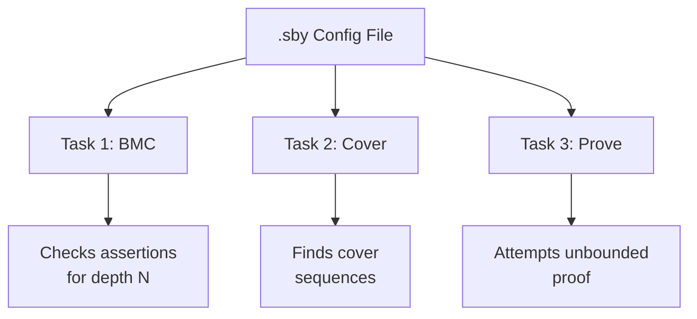

---

## Running Formal Verification

### Running a Single Task

```bash
# Run all tasks in the .sby file
sby -f my_design.sby

# Run a specific task
sby -f my_design.sby task_name
```

### Understanding the Output

```
SBY 14:32:10 [in_stage_tastbmc] engine_0: ##   0:00:00  Checking assumptions in step 0..
SBY 14:32:10 [in_stage_tastbmc] engine_0: ##   0:00:00  Checking assertions in step 0..
SBY 14:32:10 [in_stage_tastbmc] engine_0: ##   0:00:01  Checking assertions in step 1..
...
SBY 14:32:15 [in_stage_tastbmc] engine_0: ##   0:00:05  Checking assertions in step 20..
SBY 14:32:15 [in_stage_tastbmc] engine_0: ##   0:00:05  Status: passed
SBY 14:32:15 [in_stage_tastbmc] engine_0: finished (returncode=0)
SBY 14:32:15 [in_stage_tastbmc] DONE (PASS, rc=0)
```

### Result Interpretation

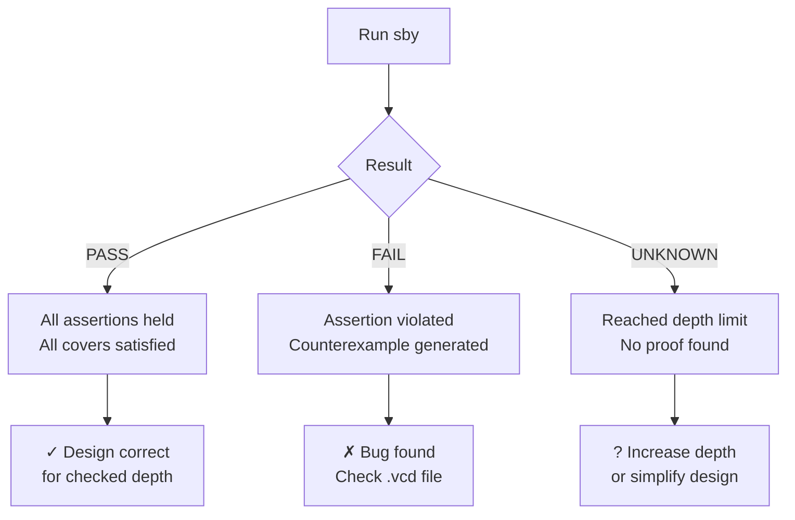

### Output Directory Structure

After running, sby creates a directory with results:

```
in_stage_tastbmc/
├── config.sby              # Copy of configuration
├── logfile.txt            # Detailed log
├── status                 # PASS/FAIL status
├── PASS                   # Empty file indicating success
├── engine_0/
│   ├── logfile.txt       # Solver log
│   └── trace*.vcd        # Counterexample waveforms (if FAIL)
├── model/
│   └── design.il         # Internal representation
└── src/
    └── *.v               # Copies of source files
```

---

## Analyzing Results

### Successful Verification

When all assertions pass and all covers are satisfied:

```
SBY [task_name] DONE (PASS, rc=0)
```

This means:
- No assertion violations found within the specified depth
- All cover properties found reachable sequences
- Design behaves as specified (within bounds)

### Assertion Failures

When an assertion fails, sby generates a **counterexample**:

```
SBY [task_name] DONE (FAIL, rc=2)
SBY [task_name] Assert failed: my_assertion
SBY [task_name] counterexample: engine_0/trace.vcd
```

### Viewing Counterexamples with GTKWave

```bash
# View the counterexample waveform
gtkwave in_stage_tastbmc/engine_0/trace.vcd
```

GTKWave shows you the exact input sequence that caused the assertion to fail:

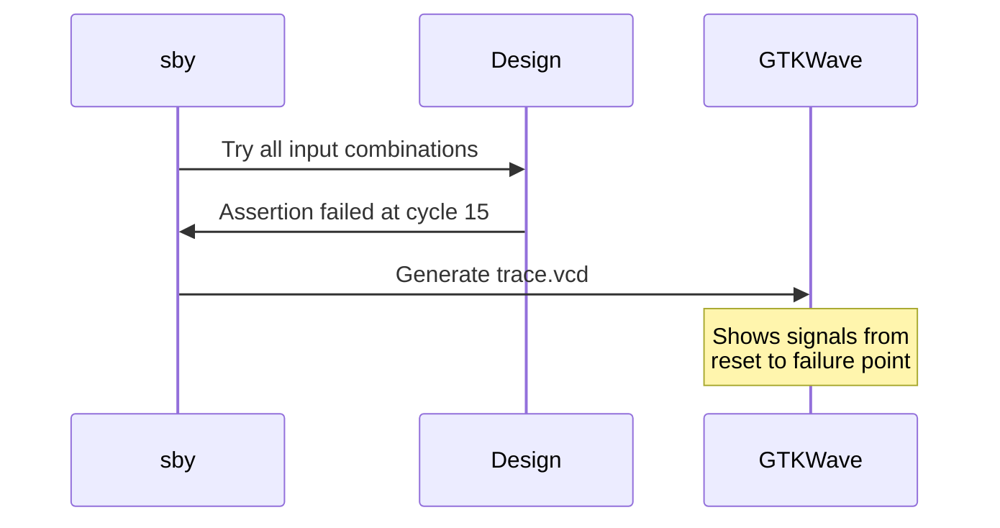

### Reading GTKWave Traces

1. **Add signals**: Drag signals from SST (Signal Search Tree) to the waveform viewer
2. **Locate failure**: Look for the clock cycle where the assertion failed
3. **Work backwards**: Check input values leading up to the failure
4. **Identify root cause**: Determine why the assertion was violated

### Cover Analysis

For cover tasks, sby generates traces showing how to reach the covered condition:

```
SBY [cover_task] DONE (PASS, rc=0)
SBY [cover_task] trace0.vcd: reach_max SATISFIED
SBY [cover_task] trace1.vcd: transition_check SATISFIED
```

Each `.vcd` file shows one way to satisfy the cover property. Use these to:
- Verify your assumptions about reachability
- Generate interesting test cases for simulation
- Understand design behavior

---

## Practical Example Walkthrough

Let's walk through formal verification of the `in_stage` module from this project.

### Design Under Test

```verilog
module in_stage (
    input wire clk,
    input wire rst_n,
    input wire invert_polarity,
    input wire [6:0] ipins,
    output reg [6:0] ivalues
);

    always @(posedge clk) begin
        if (!rst_n) begin
            ivalues <= 7'b0;
        end else begin
            if (invert_polarity) begin
                ivalues <= ~ipins;
            end else begin
                ivalues <= ipins;
            end
        end
    end

endmodule
```

### Specification

The `in_stage` module should:
1. Reset `ivalues` to 0 when `rst_n` is low
2. When `invert_polarity` is 1, output inverted input (`ivalues = ~ipins`)
3. When `invert_polarity` is 0, output equals input (`ivalues = ipins`)

### Writing the Testbench

```verilog
`default_nettype none
`timescale 1ns/1ps

module in_stage_tb;
    reg clk;
    reg rst_n;
    reg invert_polarity;
    reg [6:0] ipins;
    wire [6:0] ivalues;

    // Instantiate design
    in_stage uut (
        .clk(clk),
        .rst_n(rst_n),
        .invert_polarity(invert_polarity),
        .ipins(ipins),
        .ivalues(ivalues)
    );

`ifdef FORMAL
    reg f_past_valid = 0;
    
    // Assume reset is initially asserted
    initial assume(rst_n == 0);
    
    always @(posedge clk) begin
        f_past_valid <= 1;
        
        if (f_past_valid) begin
            // ASSERTIONS: Check correct behavior
            
            // Property 1: Reset behavior
            if ($past(rst_n) == 0) begin
                _a_prove_reset_: assert(ivalues == 7'b0);
            end else begin
                // Property 2: Invert mode
                if ($past(invert_polarity)) begin
                    _a_prove_invert_: assert(ivalues == ~$past(ipins));
                // Property 3: Normal mode
                end else begin
                    _a_prove_no_invert_: assert(ivalues == $past(ipins));
                end
            end
            
            // COVERS: Check reachability
            
            // Cover 1: Can we reach invert mode with non-zero output?
            _c_prove_invert_: cover($past(invert_polarity) && 
                                    $past(ipins) == ~ivalues && 
                                    ivalues != 7'b0);
            
            // Cover 2: Can we reach normal mode with non-zero output?
            _c_prove_no_invert_: cover(!$past(invert_polarity) && 
                                       $past(ipins) == ivalues && 
                                       ivalues != 7'b0);
        end
    end
`endif

endmodule
```

### Configuration File

```ini
[tasks]
taskcover prove_cover
tastbmc prove_bmc

[options]
prove_cover: mode cover
prove_cover: depth 100
prove_bmc: mode bmc

[engines]
smtbmc

[files]
../../src/in_stage.v
in_stage_tb.v

[script]
read -formal in_stage.v 
read -formal in_stage_tb.v
prep -top in_stage_tb
```

### Running Verification

```bash
cd test/sby
sby -f in_stage.sby
```

### Expected Results

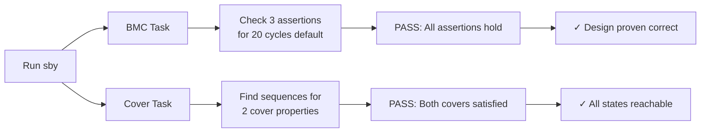

Both tasks should pass:
- **BMC**: All assertions hold for the checked depth
- **Cover**: Both cover properties are satisfied

### What We Proved

1. ✓ Reset always clears output to zero
2. ✓ Invert mode correctly inverts input
3. ✓ Normal mode correctly passes input
4. ✓ Both modes are reachable with non-zero data

---

## Best Practices

### 1. Start Small

Begin with simple properties before tackling complex ones:

```verilog
// Start with: Reset behavior
assert(reset ? (output == 0) : 1);

// Then add: Basic functionality
assert(output == expected_value);

// Finally: Complex sequences
assert($past(condition1) && $past(condition2) -> result);
```

### 2. Use Meaningful Labels

```verilog
// Good
reset_clears_counter: assert(counter == 0);
overflow_detected: assert(overflow_flag == 1);

// Bad
a1: assert(counter == 0);
check: assert(overflow_flag == 1);
```

### 3. Balance Depth vs. Runtime

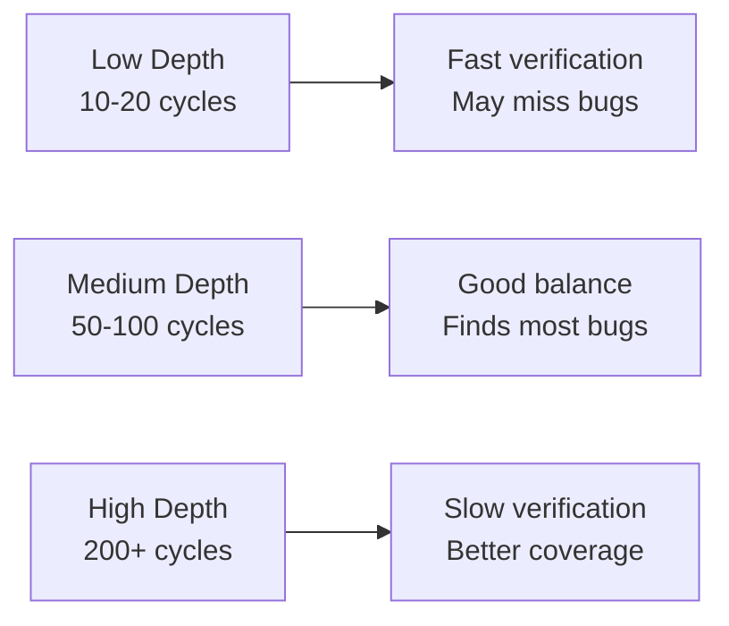

Start with low depth for quick feedback, then increase for thorough checking.

### 4. Use Covers to Validate Assumptions

Before writing assertions, use covers to ensure states are reachable:

```verilog
// First: Can we reach this state?
cover(state == TARGET_STATE);

// Then: Assert property about that state
if (state == TARGET_STATE) begin
    assert(output == expected);
end
```

### 5. Constrain Inputs Appropriately

Use assumptions to model realistic input constraints:

```verilog
// Unrealistic: Allow any value
// (formal tool may find meaningless violations)

// Better: Constrain to valid range
assume(input_addr < MAX_ADDR);
assume(data_valid -> data_size <= MAX_SIZE);
```

### 6. Separate Design and Verification

Keep formal properties in testbench modules, not in the design itself:

```
✓ design.v         - Pure synthesizable RTL
✓ design_tb.v      - Testbench with formal properties
```

### 7. Incremental Verification

Verify modules individually before integrating:

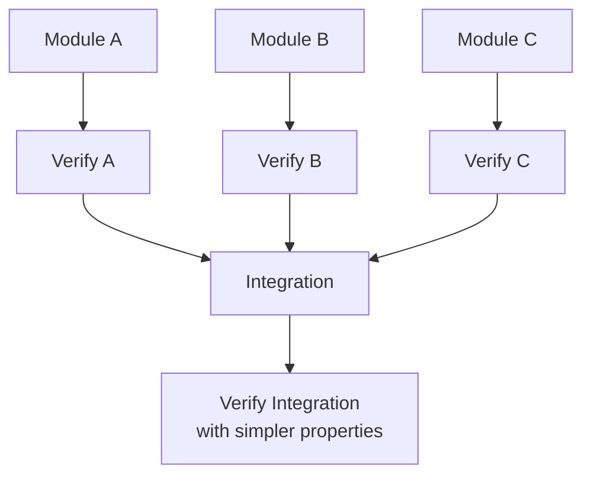

---

## Common Pitfalls

### 1. Forgetting `f_past_valid`

**Problem**: Using `$past()` in the first clock cycle causes errors.

```verilog
// Wrong - may cause issues
always @(posedge clk) begin
    assert(output == $past(input));  // Error on first cycle!
end

// Correct - guard with f_past_valid
reg f_past_valid = 0;
always @(posedge clk) begin
    f_past_valid <= 1;
    if (f_past_valid) begin
        assert(output == $past(input));  // Safe
    end
end
```

### 2. Over-Constraining with Assumptions

**Problem**: Too many assumptions make verification meaningless.

```verilog
// Wrong - assumes away all interesting cases
assume(input_a == 5);
assume(input_b == 10);
assume(state == IDLE);

// Correct - only constrain what's necessary
assume(input_a < MAX_VALUE);
// Let tool explore all states
```

### 3. Unreachable Cover Properties

**Problem**: Cover property can never be satisfied.

```verilog
// Wrong - contradictory conditions
cover(signal_a == 1 && signal_a == 0);  // Impossible!

// Correct - use temporal logic
cover(signal_a == 1 && $past(signal_a) == 0);  // Rising edge
```

### 4. Insufficient Depth

**Problem**: Verification depth too shallow to find bugs.

```ini
[options]
task: depth 5  # Too shallow for complex sequences
```

If your design has a pipeline depth of 10, you need at least depth > 10 to see full behavior.

### 5. Ignoring Solver Warnings

Pay attention to warnings in the log:

```
Warning: Wire 'my_signal' has x-bits
Warning: Timeout reached, verification incomplete
```

These often indicate issues with your design or properties.

### 6. Not Testing Cover Properties

**Problem**: Assuming assertions are correct without checking reachability.

```verilog
// Always test that your covers can be satisfied
if (mode == SPECIAL) begin
    assert(output == special_value);
end

// Add cover to verify SPECIAL mode is reachable
cover(mode == SPECIAL);
```

---

## Advanced Topics

### Multi-Clock Designs

For designs with multiple clock domains:

```verilog
always @(posedge clk_a) begin
    if (f_past_valid_a) begin
        // Assertions for clk_a domain
    end
end

always @(posedge clk_b) begin
    if (f_past_valid_b) begin
        // Assertions for clk_b domain
    end
end
```

### State Machine Verification

```verilog
// Verify state transitions
always @(posedge clk) begin
    if (f_past_valid) begin
        // Ensure valid states only
        assert(state inside {IDLE, ACTIVE, DONE});
        
        // Check legal transitions
        if ($past(state) == IDLE && trigger) begin
            assert(state == ACTIVE);
        end
        
        // Cover all transitions
        cover($past(state) == IDLE && state == ACTIVE);
        cover($past(state) == ACTIVE && state == DONE);
        cover($past(state) == DONE && state == IDLE);
    end
end
```

### Induction Proofs

For unbounded proofs, use the `prove` mode:

```ini
[options]
task: mode prove
task: depth 20  # Base case depth
```

The tool tries to prove by induction:
1. **Base case**: Property holds for initial states
2. **Inductive step**: If property holds at cycle N, it holds at N+1

---

## Resources

### Official Documentation
- [SymbiYosys Documentation](https://symbiyosys.readthedocs.io/)
- [Yosys Manual](http://www.clifford.at/yosys/documentation.html)

### Learning Resources
- [ZipCPU Formal Verification Tutorials](https://zipcpu.com/formal/formal.html)
- [Formal Verification with SymbiYosys](https://github.com/YosysHQ/SymbiYosys)

### Tools
- **GTKWave**: Waveform viewer for counterexamples
- **Yosys**: Synthesis tool (backend for sby)
- **SMT Solvers**: Z3, Boolector, Yices (formal engines)

---

## Quick Reference

### Common Temporal Operators

| Operator | Description | Example |
|----------|-------------|---------|
| `$past(sig)` | Value in previous cycle | `$past(count) + 1` |
| `$past(sig, N)` | Value N cycles ago | `$past(data, 3)` |
| `$stable(sig)` | Signal unchanged | `$stable(address)` |
| `$rose(sig)` | 0 → 1 transition | `$rose(valid)` |
| `$fell(sig)` | 1 → 0 transition | `$fell(reset)` |
| `$changed(sig)` | Signal changed value | `$changed(state)` |

### Verification Keywords

| Keyword | Purpose | Example |
|---------|---------|---------|
| `assert` | Property must hold | `assert(a == b);` |
| `assume` | Constrain inputs | `assume(x < 10);` |
| `cover` | Find satisfying sequence | `cover(state == DONE);` |

### .sby Configuration Modes

| Mode | Purpose | When to Use |
|------|---------|-------------|
| `bmc` | Bounded Model Checking | Find bugs quickly |
| `cover` | Coverage checking | Verify reachability |
| `prove` | Unbounded proof | Prove correctness for all time |

---

## Conclusion

Formal verification is a powerful addition to your verification toolkit. By mathematically proving properties of your design, you can catch subtle bugs that simulation might miss and gain confidence in your hardware's correctness.

**Key Takeaways**:
1. Start with simple properties and gradually add complexity
2. Use covers to validate your assumptions
3. Balance verification depth with runtime
4. Combine formal verification with simulation for comprehensive coverage
5. View counterexamples in GTKWave to understand failures

Now you're ready to add formal verification to your own Verilog designs. Start with a small module, write a few assertions, and see what corner cases the tools can find!

---
