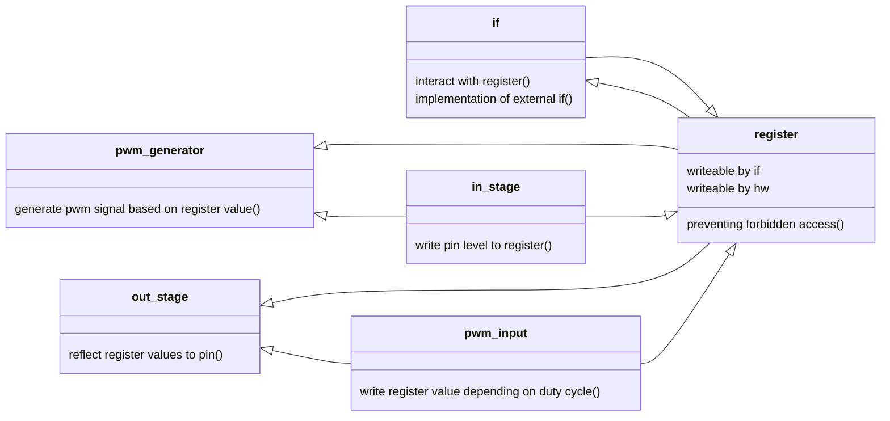
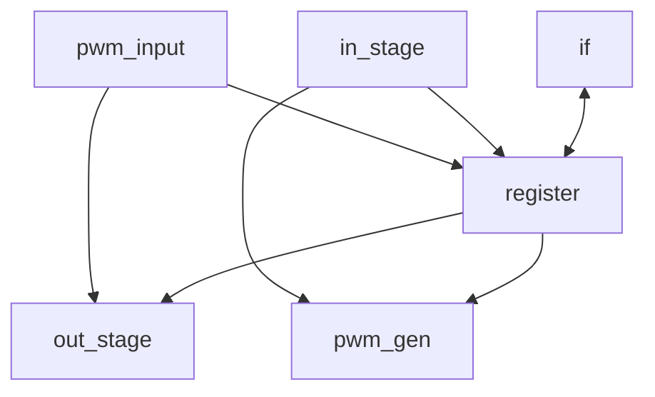

# General
This test project involves writing to and reading from a register to configure output pins and monitor input pins. Additionally, a PWM signal will be generated based on the values written to this register, while another register will provide the duty cycle of an incoming PWM signal.


For debugging purposes, the PWM generator can be configured either through the register or by utilizing the in_stage. A select bit, which is configurable via the register, controls this selection.

A second register-configurable select bit determines the out_stage behavior, choosing whether to write the incoming PWM duty cycle to the outputs or reflect the register values. 

# Sub-Modules

## out_stage
On every clock cycle, the out_stage module writes either the register value or the incoming PWM duty cycle to the output pins, based on the sel_pwm control signal.

```verilog
module out_stage (
    input wire clk,
    input wire rst_n,
    input wire sel_pwm,
    input wire invert_polarity,
    input wire [6:0] ovalues,
    input wire [6:0] pwm_dc,
    output reg [6:0] opins
    );
```
* The invert_polarity signal controls the opins register polarity.

## in_stage
On every clock cycle, the in_stage module reads the input pins and writes the values to both the register and the PWM generator.

```verilog
module in_stage (
    input wire clk,
    input wire rst_n,
    input wire invert_polarity,
    input wire [6:0] ipins,
    output reg [6:0] ivalues
    );
```
* The invert_polarity signal controls the ivalues register polarity.

## pwm_gen
The pwm_gen module is a pulse width generator.


```verilog
module pwm_gen (
    input wire clk,
    input wire rst_n,
    input wire sel_inpins,
    input wire invert_polarity,
    output reg pwm_sig,
    input wire [6:0] duty_cycle_o
    );
```
* The period of the pwm signal shall be 20 ms.
* The duty cycle of the pwm signal shall be configurable between 1000 us and 2000 us. 
   * The duty_cycle_o signal controls the duty cycle. 
   * A 0 value represents 1000 us and a 100 value represents 2000 us. 
   * Any value higher than 100 shall be interpreted as 2000 us. 
* An update of the duty cycle shall only affect the next start of the high pulse.
* The sel_inpins signal controls if the duty cycle is controlled by the input pins or the register. 
* The invert_polarity signal controls the pwm_sig register polarity.

## pwm_input
The pwm_input module measures the duty cycle of an incoming PWM signal with a 20 ms period and a duty cycle between 1000 us and 2000 us.


```verilog
module pwm_input (
    input wire clk,
    input wire rst_n,
    input wire invert_polarity,
    input wire pwm_in,
    output reg [6:0] duty_cycle_i
    );
```
* The module measures the duty cycle of the incoming PWM signal in 10 microsecond steps, starting the measurement after the first 1000 us of the pulse.
* When the PWM signal changes from low to high, the counter shall be reset to zero.
* When the PWM signal returns to low, the duty_cycle_i register shall be updated with the measured count value. 
* During a reset of the module the output register duty_cycle_i shall be set to 127. 
* If the duty cycle of the incoming PWM signal is below 1000 us, then the output register duty_cycle_i shall be set to 126. 
* If the duty cycle of the incoming PWM signal is above 2000 us, then the output register duty_cycle_i shall be set to 125. 
* The invert_polarity signal controls the pwm_in signal polarity.

## if
The interface module allows external communication with the hardware via the register module. Writing to registers configures the hardware behavior, while reading from registers reflects the current hardware status.

The interface module uses an SPI interface.

```verilog
module pwm_input (
    input wire clk,
    input wire rst_n,
    input wire spi_cs_n,
    input wire spi_sck,
    input wire spi_mosi,
    output reg spi_miso
    );
```

* Data shall be shifted out with the most-significant bit (MSB) first.
* SPI mode 0 shall be implemented:
    * Data is shifted out on the falling edge of `spi_sck`.
    * Data is sampled on the rising edge of `spi_sck`.
* A SPI command shall be implemented as follows:
    * A command consists of an 8-bit address followed by 8-bit data.
    * The MSB of the address determines whether to write or read: `1` writes to the register, `0` reads from the register.
* Communication starts when `spi_cs_n` is driven low. When `spi_cs_n` returns high, the SPI logic shift register shall be reset.
* A clock-domain crossing needs to be implemented to handle the different clocks of `spi_sck` and `clk`.

## register
The register module stores configuration and status values that can be written by the interface or the hardware. All registers are readable by the interface, but only some registers are writable by the interface.

|  Addr | Name | IF write | Bit 7  | Bit 6  | Bit 5 | Bit 4 | Bit 3 | Bit 2 | Bit 1 | Bit 0 | Default  |
|:---|:---|:---|:---|:---|:---|:---|:---|:---|:---|:---|:----|
|  0x4 | Pinout | yes | sel_pwm <td colspan=7> ovalues </td> | 1000_0000 |
|  0x3 | Pinin | no | <td colspan=7> ivalues </td> |  |
|  0x2 | PWMgen | yes| sel_inpins <td colspan=7> duty_cycle_o </td> | 1000_0000 |
|  0x1 | PWMin | no |  <td colspan=7> duty_cycle_i </td> |  |
|  0x0 | Polarity | yes |   |   |   |  ipPinout | ipPinin  |   ipPWMgen|  ipPWMin|   | 0000_0000   |


# Top-Level

* The clock frequency is assumed to be 12 MHz, which aligns with the clock frequency of the FPGA ICEbreaker v1.1 development board.
* `ui_in[6:0]` shall be used for the in_stage `ipins`.
* `ui_in[7]` shall be used for the pwm_input `pwm_in`.
* `uo_out[6:0]` shall be used for the out_stage `opins`.
* `uo_out[7]` shall be used for the pwm_gen `pwm_sig`.
* SPI interface shall be as following:
  * `uio[0]` - CS_N (configured as input)
  * `uio[1]` - MOSI (configured as input)
  * `uio[2]` - MISO (configured as output)
  * `uio[3]` - SCK (configured as input)


