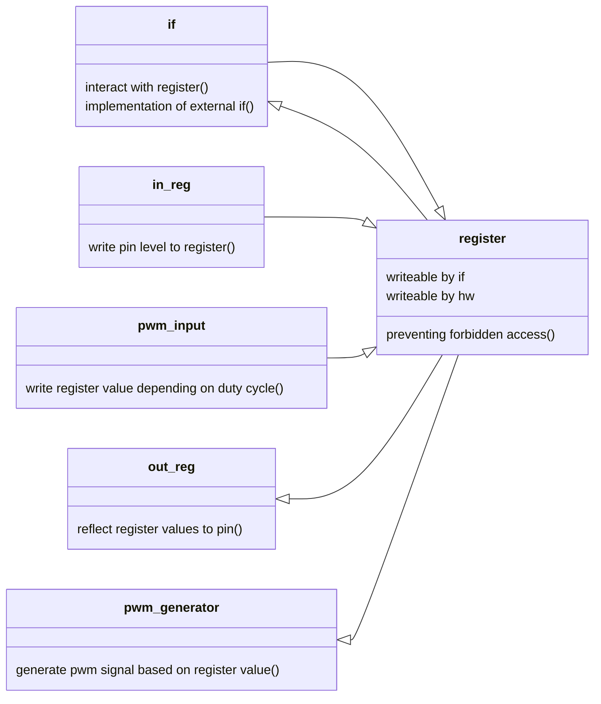
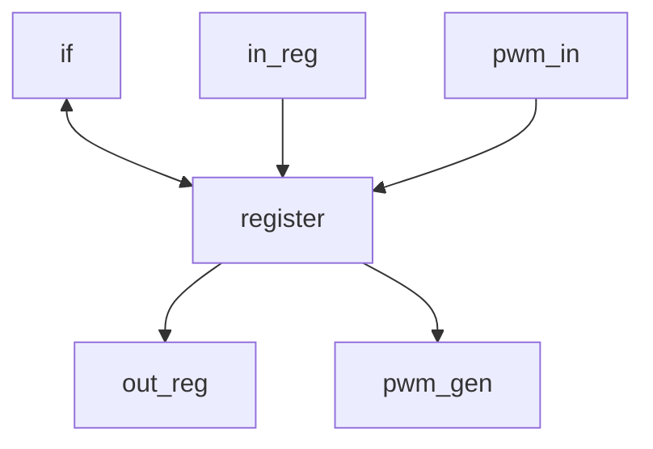

# General
This test project involves writing to and reading from a register to configure output pins and monitor input pins. Additionally, a PWM signal will be generated based on the values written to this register, while another register will provide the duty cycle of an incoming PWM signal.



# Sub-Modules

## out_reg
On every clock cycle the value of the register shall be written to the output pins

```verilog
module out_reg (
    input wire clk,
    input wire reset,
    input wire [6:0] ovalues[6:0]
    output reg [6:0] opins
    );
```

## in_reg
On every clock cycle the value of the input pins shall be written to the register

```verilog
module in_reg (
    input wire clk,
    input wire reset,
    input wire [6:0] ipins,
    output reg [6:0] ivalues
    );
```

## pwm_gen
The pwm_gen module is a pulse width generator.


```verilog
module pwm_gen (
    input wire clk,
    input wire reset,
    output reg pwm_sig,
    input wire [7:0] duty_cycle
    );
```
* The period of the pwm signal shall be 20 ms.
* The duty cycle of the pwm signal shall be configurable between 1000 us and 2000 us.
* An update of the duty cycle shall only effect the next start of the high pulse.

# Top-Level


